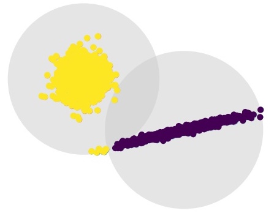
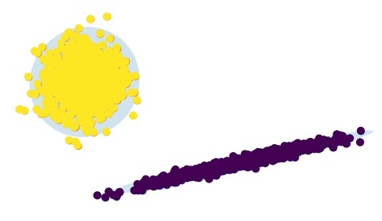

# Deep Gaussian Mixture Models

### STEPHEN SCARANO, YI WEI; University of Massachusetts, Amherst, USA

**Abstract:** The last decade has witnessed tremendous progress in
deep learning classification tasks; however, these models often rely on a notable “closed-set assumption”: that classes observed in test-time are a subset of those observed during train-time. We present a new method, called Novel-Net, which integrates Gaussian Mixture Models into an arbitrary deep network architecture to discriminate instances not seen during training time. Our model consistently outperforms conventional techniques such as Nearest-Class Mean and Model Confidence, boosting accuracy by 12% in binary classification tasks.

### 1. Introduction
Image classification has made significant progress since the incorporation of Neural Network approaches. However, a common assumption many models make is that at test-time the set of classes encountered would be a subset of all the classes the model observed at train-time [5]. In other words, Neural Networks do not know what they do not know.

Consider the case of an automated diagnostician agent trained on samples of k distinct pathologies. At test-time the agent should not only correctly distinguish between corresponding test samples, but ideally identify unfamiliar samples and signal caution. In this example, the agent’s ability to identify novel samples could make the difference in discovering a new variant of a highly infectious virus, or simply avoiding a diagnosis with incomplete information. For high-risk deployment, machine learning models must competently acknowledge their limits and drop the assumption that classes seen at test-time are a subset of those observed during train-time.

| K-Means              | Gaussian Mixture Models |
| :---                 |     ---:               |      
| || 

We are not the first to consider the problem of Open Set Recognition (OSR), and benefit from work spanning both traditional ML and deep learning disciplines. In that spirit, we integrate deep learning architectures with Gaussian Mixture Models (GMMs), which fit inputs to a predetermined number of normal distributions. We opt for GMMs since they have an intuitive notion of distance which still preserves complex relationships in the data. For clarification,consider the scenario shown in Figure 1.

### 2. Related Work

Gaussian Mixture Models are by no means universal approximators [8], but their descriptive flexibility exceeds that of a strict K-Means method [18]. In addition, their decisions are fundamentally explainable, which may be prioritized in high-impact contexts. The greatest theoretical hurdle—and the crux of our work here—is whether the feature space can be meaningfully approximated by a computationally acceptable number of Gaussian clusters.
In short, we seek to identify and reject samples from some novel class, _N_, ideally without compromising model performance. For the sake of this paper, we consider perfor- mance in terms of standard accuracy and measure detection of _N_ by novel-class recall.

Reviews of Open Set Recognition (OSR) and Open World Learning (OWL) typically partition the input space into four quadrants [6, 9, 17]:

- _Known-known classes_ (KKCs): traditional data samples, seen at train time and exemplify one of k classes.
- _Known-unknown classes_ (KUCs): negative data samples defined by a lack of positive instances from other classes; i.e, background classes (think object detec- tion [10]).
- _Unknown-known classes_ (UKCs): Classes with no available data samples during training, but with avail- able semantic information.
- _Unknown-unknown classes_ (UUCs): Classes not encountered during training and also lack semantic in- formation. Essentially, these are data instances that are completely unexpected.


```
Fig. 2. Example of a PMC instance appending two perspectives from the same image 
```

#### 3.3. Local Regression
In Local Regression, we perform regression on the image’s point-coordinates. Research on visual geolocation is largely absent of regression problems, at least as far as neural network solutions go. My general intuitions for this are listed in the Related Works section, and I include it here primarily as a trial to contrast against other approaches.

#### 3.4. Partitioned Local-Classification
Partitioned Local-Classification is the contemporary go-to workaround to the constraints of Local Regression. By dividing the coordinate-map of a space into discrete cells (essentially overlaying a grid), we appropriate the benefits of traditional classification without the drawbacks of a regression problem. On the downside, we might expect (depending upon our partitions) a model to struggle with the arbitrary cell dividing lines, particularly on a local scale.


```
Fig. 3. Pittsburgh data instances partitioned by arbitrary boundary (left) vs. clustered grouping (right). The clustering appears to naturally group points into city outskirts and the city center.
```

#### 3.5 Clustered Local-Classification
I believe Clustered Local-Classification is my largest contribution to the visual geolocation field, sharpening the rough edges of the PLC approach. Rather than choosing an arbitrary set of gridlines to divide up a local area, we instead take inspiration from the R-CNN architecture, proposing potential division lines with apriori information [3]. While the potential applications are vast, the scope of this paper will concern a K-Means clustering of points by coordinate distance. I hope to demonstrate that these "natural" division lines lay a firmer groundwork for classification.


```
Table 2. Best Model Accuracy and F1 Evaluation over 10 Epochs
```

### 4. EXPERIMENTATION

As suggested above, each problem approach will be evaluated using essentially the same CNN architecture applied to the CVRC Google Street map dataset. The specifics of each trial’s methodology are described below. Note that due to hardware limitations, all instances have been scaled down to more laptop-friendly 100x100 images.


#### 4.1. Conventional and Panoramic Macro-Classification

As a result of hardware limitations, I extract an 11,000 image subset containing an equal mix of Pittsburgh and Orlando instances. Each instance is labeled accordingly, and the model is trained using the architecture shown in Table 1. Panoramic Classification follows nearly the same methodology, except for every point in space (where each point corresponds to 5 images total), we append two images width-wise together, producing a new image of size 3x200x100. These new modified training images are then used to train a near-identical model with slight dimension accommodations listed in the rightmost column. Training will continue over 10 Epochs, and the best model is selected and assessed in the _Results_ section below.

#### 4.2. Local Regression
Local Regression discards labels in favor of training directly on the coordinates themselves. A 11, Pittsburgh-image sample is trained on using the _L1 loss_ function, yet apart from these changes, the architecture and methodology remain the same. Training will continue over 10 Epochs, and the best model is selected and assessed in the Results section below.


#### 4.3. Partitioned and Clustered Local-Classification
Partitioned and Clustered Local-Classification will utilize an identical model to that of Conventional Classification; however, applied to the 11,000 sample of Pittsburgh images. In the case of the former, a line will be drawn vertically such that Pittsburgh images to its east will be labeled differently than their neighbors to the west of it. In the case of the latter, we label points only after performing K-Means clustering and evaluating their distance to each centroid, i.e, images in Cluster A will be labeled differently than those in Cluster B. Training will continue over 10 Epochs, and the best model is selected and assessed in the Results section below.

#### 4.4. Results


```
Fig. 4. Accuracy and F1 Evaluation for Macro and Local Classification models
```

Training evaluation metrics have been tracked by epoch for each classification model (see figure 4) and the best of each is listed in Table 2. Conventional and Panoramic Macro-Classification unsurprisingly outperform all other models; however, it is interesting that the latter both converges faster than and exceeds the former with half the training set size. Unfortunately, this expansion in the feature space came at the cost of added computational burden, and to avoid scaling down the images I migrated the code to Google’s _Colab Pro_ service. Clustered Local Classification consistently outperforms Partitioned Classification by about 4-5%, with negligible computational overhead. Local Regression was largely (and expectedly) a failure: after 10 epochs, the best model predicted coordinate locations with an average L1 error of 0.4◦ which is less impressive than it sounds considering that 0.4◦ spans the entire city of Pittsburgh.


```
Fig. 5. Model loss (left) alongside example saliency map (right) – the latter [Partition Classification] appears
to take interest in building texture and skylines
```

A saliency map analysis (example in Figure 5) demonstrates that the local-partition model appears moderately attracted to characteristic structures (i.e skylines, building texture, etc.), though the visual relationship is not overwhelming. More strongly, the model favors human and car elements – suggesting that partitions based on demographic attributes (wealth, ethnicity) may better characterize local geography than architecture. This may suggest that although architectural identity is indeed quite relevant to the trained classification model, so too is the background noise of pixel brightness and general hue.


```
Fig. 6. Saliency map of Conventional Macro-Classification. The model appears to take interest in both humans
and cars.
```

### 5. CONCLUSION

I hoped to demonstrate that our approach to a deep learning problem is as critical to success as the architecture itself—that it is as necessary to ask the question of "In what ways can I solve the problem" as "In what ways can I alter the problem". If identifying an image in one of _n_ partitioned cells is the stated goal, it seems unimaginative to overlay an arbitrary boundary when an comparatively learnable one is available. In this paper, the scope of the problem is limited, but we may imagine learned partitions clustered over many potential features of interest (year founded, resident demographics, etc.) such that the application of a CNN is optimal. Compared to a Panoramic feature-extending approach the computational cost is minimal, and its performance benefit is significant. I would like to see (and perform) research which explores this road. Additionally, much of the work done in this paper is done at a small scale utilizing a generic CNN model, yet I’d be curious to analyze the evaluation metrics done on more contemporary architectures; particularly the Inceptio nmodel comes to mind as the visual geolocation problem stands to benefit from a spatially dynamic architecture.


#### 5.1. Ethical Implications

Partly in reaction to recent breakthroughs in neural network research—journalists, academics, and computer scientists continue to voice concern regarding the ongoing deployment of advanced computer vision products. Whether in the hands of stalkers, federal intelligence, or local law enforcement, these technologies have the potential to locate citizens automatically, and as such their use must be vetted by those same citizens.

### ACKNOWLEDGMENTS

To Connor O’Brien, who picked up takeout while I worked on this.


### REFERENCES

[1] Jan Brejcha and Martin Cadik. 2017. State-of-the-art in visual geo-localization.Pattern Analysis and Applications20 (
2017). https://doi.org/10.1007/s10044-017-0611-

[2] Carl Doersch, Saurabh Singh, Abhinav Gupta, Josef Sivic, and Alexei A. Efros. 2012. What Makes Paris Look like Paris?
ACM Trans. Graph.31, 4, Article 101 (jul 2012), 9 pages. https://doi.org/10.1145/2185520.

[3] Ross B. Girshick, Jeff Donahue, Trevor Darrell, and Jitendra Malik. 2013. Rich feature hierarchies for accurate object
detection and semantic segmentation.CoRRabs/1311.2524 (2013). arXiv:1311.2524 [http://arxiv.org/abs/1311.](http://arxiv.org/abs/1311.)

[4] Eric Müller-Budack, Kader Pustu-Iren, and Ralph Ewerth. 2018. Geolocation Estimation of Photos using a Hierarchical
Model and Scene Classification.

[5] Christian Szegedy, Wei Liu, Yangqing Jia, Pierre Sermanet, Scott E. Reed, Dragomir Anguelov, Dumitru Erhan, Vincent
Vanhoucke, and Andrew Rabinovich. 2014. Going Deeper with Convolutions.CoRRabs/1409.4842 (2014). arXiv:1409.
[http://arxiv.org/abs/1409.](http://arxiv.org/abs/1409.)

[6] Tobias Weyand, Ilya Kostrikov, and James Philbin. 2016. PlaNet - Photo Geolocation with Convolutional Neural
Networks.CoRRabs/1602.05314 (2016). arXiv:1602.05314 [http://arxiv.org/abs/1602.](http://arxiv.org/abs/1602.)

[7] Amir Roshan Zamir and Mubarak Shah. 2014. Image Geo-Localization Based on MultipleNearest Neighbor Feature
Matching UsingGeneralized Graphs. IEEE Transactions on Pattern Analysis and Machine Intelligence36, 8 (2014),
1546–1558. https://doi.org/10.1109/TPAMI.2014.


